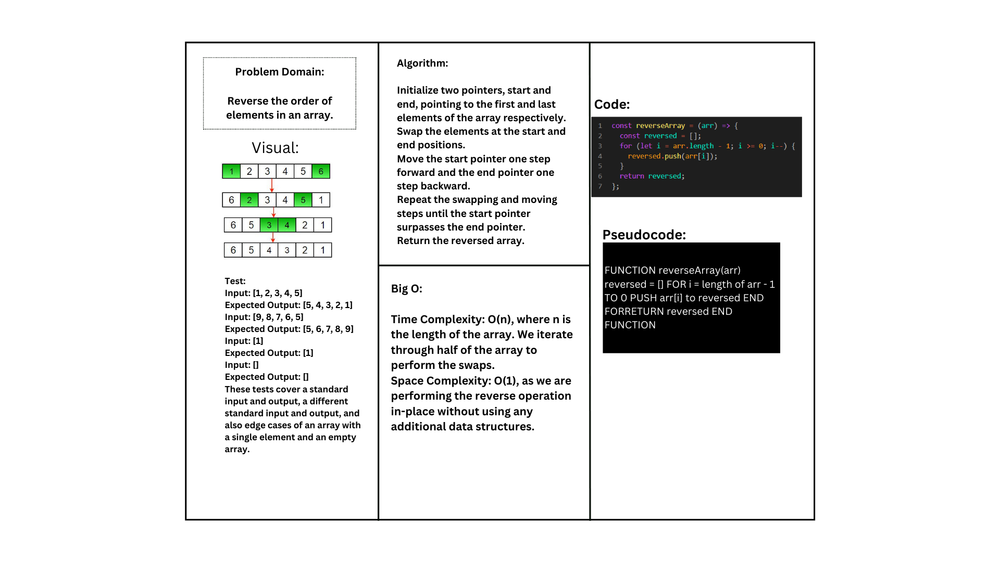

# Array Reverse

## Summary
The challenge is to reverse the order of elements in an array. The task is to implement a function called `reverseArray` that takes an array as an argument and returns a new array with the elements in reverse order. The function should not use any built-in methods available in the programming language.

## Description
Given an array, we need to reverse the order of its elements. For example, if the input is `[1, 2, 3, 4, 5]`, the expected output is `[5, 4, 3, 2, 1]`.

## Approach & Efficiency
The approach to solving this problem is to use two pointers, `start` and `end`, initialized to the first and last positions of the array respectively. We swap the elements at these positions and then move the `start` pointer one step forward and the `end` pointer one step backward. We repeat this process until the `start` pointer surpasses the `end` pointer. By swapping the elements in-place, we achieve the reverse order.

The time complexity of this algorithm is O(n), where n is the length of the array. We iterate through half of the array to perform the swaps. The space complexity is O(1) as we are performing the reverse operation in-place without using any additional data structures.

## Solution
Here is the implementation of the `reverseArray` function in JavaScript:

```javascript
const reverseArray = (arr) => {
  const reversed = [];
  for (let i = arr.length - 1; i >= 0; i--) {
    reversed.push(arr[i]);
  }
  return reversed;
};
```
## Whiteboard




The solution code can be found [here](/array-reverse.js).

## Unit Tests

The following unit tests have been written to verify the correctness of the `reverseArray` function:

### Happy Path

- Test Case 1:
  - Input: `[1, 2, 3, 4, 5]`
  - Expected Output: `[5, 4, 3, 2, 1]`

- Test Case 2:
  - Input: `['a', 'b', 'c', 'd']`
  - Expected Output: `['d', 'c', 'b', 'a']`

### Expected Failure

- Test Case 1:
  - Input: `[1, 2, 3, 4, 5]`
  - Expected Output: `[1, 2, 3, 4, 5]` (Expecting failure)

### Edge Cases

- Test Case 1:
  - Input: `[]` (empty array)
  - Expected Output: `[]` (no change)

- Test Case 2:
  - Input: `[1]` (single element)
  - Expected Output: `[1]` (no change)
