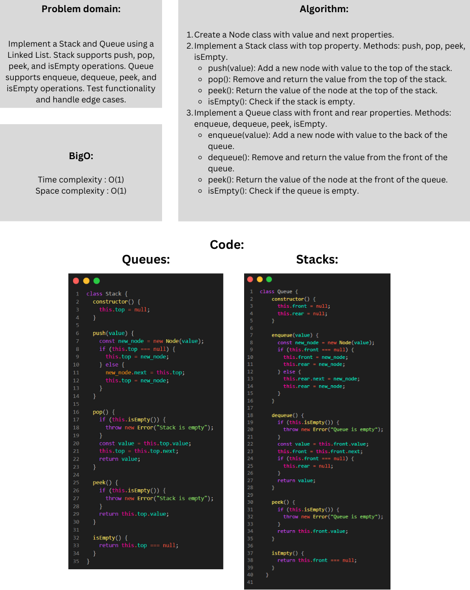
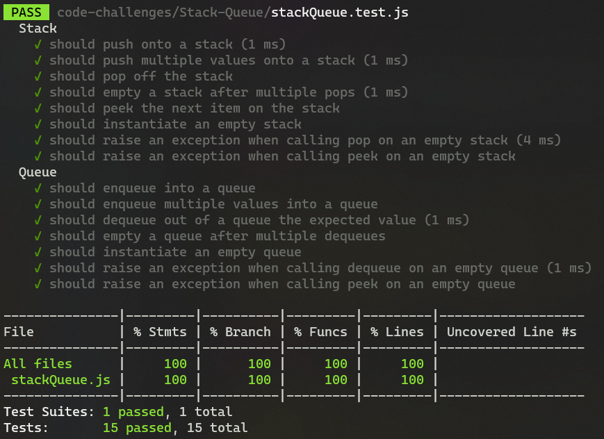

# Stacks and Queues

### Whitebord:



### Approach & Efficiency:

The Stack and Queue implementations that use a Linked List take a basic method that takes advantage of the Linked List data structure's characteristics and operations. The method and its accompanying efficiency are broken down as follows:

#### Stack Class:

- The Stack class maintains a reference to the top node of the stack.
- To push an element onto the stack, a new node is created with the given value and becomes the new top.
- To pop an element from the stack, the top node is removed, and the reference is updated to the next node.
- The peek operation simply returns the value of the top node.
- The isEmpty operation checks if the top node is null, indicating an empty stack.

#### Queue Class:

- The Queue class maintains references to the front and rear nodes of the queue.
- Enqueuing involves creating a new node with the given value and updating the rear node's reference.
- Dequeuing removes the front node and updates the front reference to the next node.
- The peek operation returns the value of the front node.
- The isEmpty operation checks if both the front and rear nodes are null, indicating an empty queue.

#### Big O:

For the Stack:

- push: O(1)
- pop: O(1)
- peek: O(1)
- isEmpty: O(1)

For the Queue:

- enqueue: O(1)
- dequeue: O(1)
- peek: O(1)
- isEmpty: O(1)
### Solution:

```javascript
// ---------- Stack ----------
class Stack {
  constructor() {
    this.top = null;
  }

  push(value) {
    const new_node = new Node(value);
    if (this.top === null) {
      this.top = new_node;
    } else {
      new_node.next = this.top;
      this.top = new_node;
    }
  }

  pop() {
    if (this.isEmpty()) {
      throw new Error("Stack is empty");
    }
    const value = this.top.value;
    this.top = this.top.next;
    return value;
  }

  peek() {
    if (this.isEmpty()) {
      throw new Error("Stack is empty");
    }
    return this.top.value;
  }

  isEmpty() {
    return this.top === null;
  }
}

// ---------- Queue ----------
class Queue {
  constructor() {
    this.front = null;
    this.rear = null;
  }

  enqueue(value) {
    const new_node = new Node(value);
    if (this.front === null) {
      this.front = new_node;
      this.rear = new_node;
    } else {
      this.rear.next = new_node;
      this.rear = new_node;
    }
  }

  dequeue() {
    if (this.isEmpty()) {
      throw new Error("Queue is empty");
    }
    const value = this.front.value;
    this.front = this.front.next;
    if (this.front === null) {
      this.rear = null;
    }
    return value;
  }

  peek() {
    if (this.isEmpty()) {
      throw new Error("Queue is empty");
    }
    return this.front.value;
  }

  isEmpty() {
    return this.front === null;
  }
}
```
### Test:

