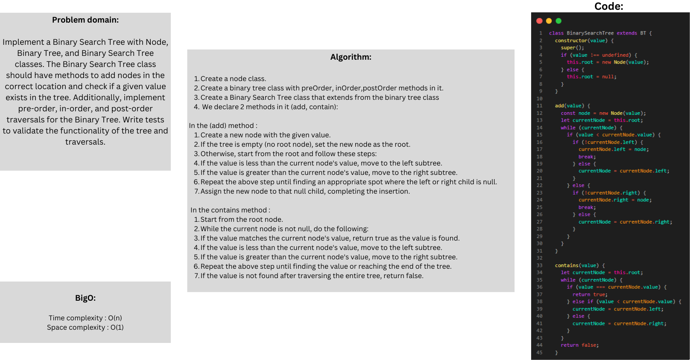
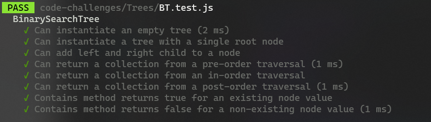

# stack-queue-brackets

### Whiteboard:



### Approach & Efficiency:

For the binary search tree , the add method have to find the correct location of thee new node by travesing the tree by  the value that has, so if the tree is balanced, the time complexity for the add method is O(log n),and in the worst case scenario become O(n)  

#### Big O:

The time complexity is O(N)
The space complexity is O(1)

### Solution:

```javascript
class BinarySearchTree extends BT {
  constructor(value) {
    super();
    if (value !== undefined) {
      this.root = new Node(value);
    } else {
      this.root = null;
    }
  }

  add(value) {
    const node = new Node(value);
    let currentNode = this.root;
    while (currentNode) {
      if (value < currentNode.value) {
        if (!currentNode.left) {
          currentNode.left = node;
          break;
        } else {
          currentNode = currentNode.left;
        }
      } else {
        if (!currentNode.right) {
          currentNode.right = node;
          break;
        } else {
          currentNode = currentNode.right;
        }
      }
    }
  }

  contains(value) {
    let currentNode = this.root;
    while (currentNode) {
      if (value === currentNode.value) {
        return true;
      } else if (value < currentNode.value) {
        currentNode = currentNode.left;
      } else {
        currentNode = currentNode.right;
      }
    }
    return false;
  }
}

```

### Test:

