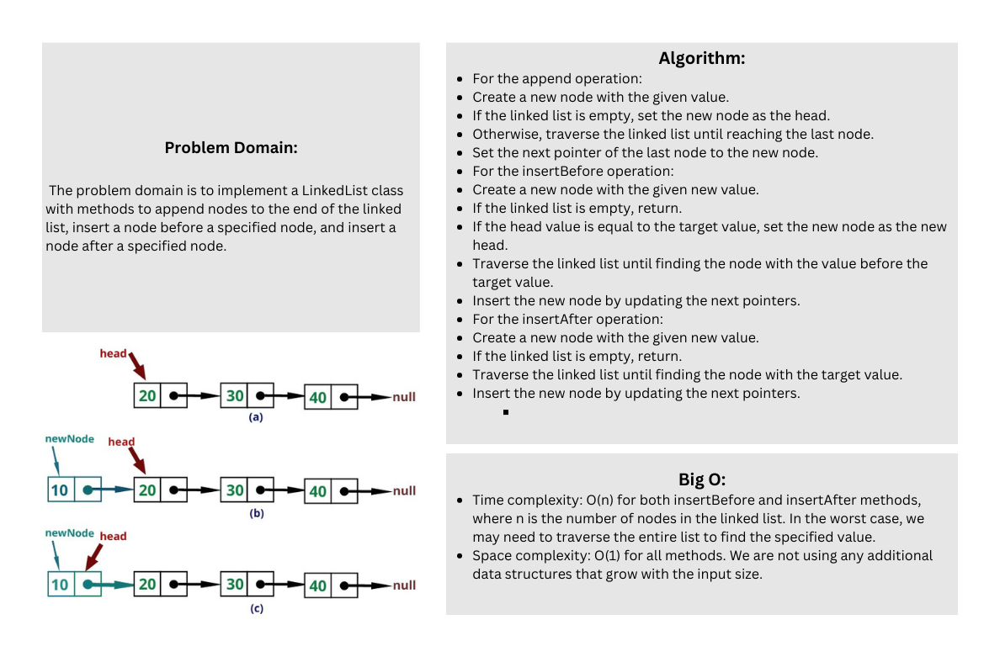

# Linked list insertions
In this code challenge, you are required to extend a Linked List implementation by adding three new methods: append, insertBefore, and insertAfter. These methods allow you to add nodes to the linked list in different positions.

## Whiteboard Process

## Approach & Efficiency
The append method simply iterates through the linked list until it reaches the last node and adds a new node with the given value at the end. This method has a time complexity of O(n), where n is the number of nodes in the linked list.

The insertBefore method searches for the node with the specified value and inserts a new node with the given value before it. It has a time complexity of O(n), where n is the number of nodes in the linked list.

The insertAfter method searches for the node with the specified value and inserts a new node with the given value after it. It also has a time complexity of O(n), where n is the number of nodes in the linked list.
## Solution
``` javascript 
    const Node = require('./node');

class LinkedList {
  constructor() {
    this.head = null;
  }

  append(newValue) {
    const newNode = new Node(newValue);
    if (!this.head) {
      this.head = newNode;
    } else {
      let current = this.head;
      while (current.next) {
        current = current.next;
      }
      current.next = newNode;
    }
  }

  insertBefore(value, newValue) {
    const newNode = new Node(newValue);
    if (!this.head) {
      return;
    }

    if (this.head.value === value) {
      newNode.next = this.head;
      this.head = newNode;
      return;
    }

    let current = this.head;
    while (current.next) {
      if (current.next.value === value) {
        newNode.next = current.next;
        current.next = newNode;
        return;
      }
      current = current.next;
    }
  }

  insertAfter(value, newValue) {
    const newNode = new Node(newValue);
    if (!this.head) {
      return;
    }

    let current = this.head;
    while (current) {
      if (current.value === value) {
        newNode.next = current.next;
        current.next = newNode;
        return;
      }
      current = current.next;
    }
  }
}

module.exports = LinkedList;
```

### Test :

```javascript
// Create a new linked list
const linkedList = new LinkedList();

// Append nodes
linkedList.append(1);
linkedList.append(3);
linkedList.append(2);

// Print the linked list
linkedList.printList(); // Output: 1 -> 3 -> 2

// Insert a node before a specific value
linkedList.insertBefore(3, 5);

// Print the updated linked list
linkedList.printList(); // Output: 1 -> 5 -> 3 -> 2

// Insert a node after a specific value
linkedList.insertAfter(3, 4);

// Print the updated linked list
linkedList.printList(); // Output: 1 -> 5 -> 3 -> 4 -> 2

```