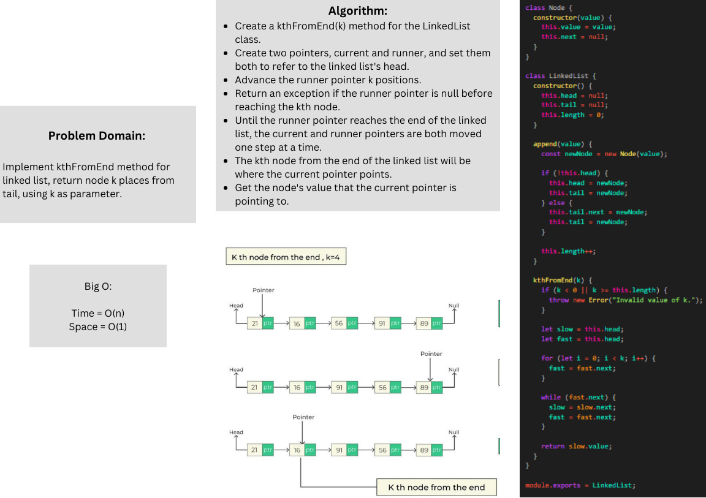

## k-th value from the end of a linked list.

### Whiteboard Process
<!-- Embedded whiteboard image -->


### Approach & Efficiency
The kth node from the end of the linked list is located using the "two-pointer" method by the kthFromEnd function of the LinkedList class. The two pointers utilized by the technique, slow and fast, start at the top of the linked list.


This method's temporal complexity, where N is the linked list's length, is O(N). In the worst scenario, the time complexity is linear because both the slow and fast pointers visit the whole linked list.


The approach takes just a constant amount of additional space to hold the slow and fast pointers, hence the space complexity is O(1).
## Solution

```javascript 
class Node {
  constructor(value) {
    this.value = value;
    this.next = null;
  }
}

class LinkedList {
  constructor() {
    this.head = null;
    this.tail = null;
    this.length = 0;
  }

  append(value) {
    const newNode = new Node(value);

    if (!this.head) {
      this.head = newNode;
      this.tail = newNode;
    } else {
      this.tail.next = newNode;
      this.tail = newNode;
    }

    this.length++;
  }

  kthFromEnd(k) {
    if (k < 0 || k >= this.length) {
      throw new Error("Invalid value of k.");
    }

    let slow = this.head;
    let fast = this.head;

    for (let i = 0; i < k; i++) {
      fast = fast.next;
    }

    while (fast.next) {
      slow = slow.next;
      fast = fast.next;
    }

    return slow.value;
  }
}

module.exports = LinkedList;
``` 


