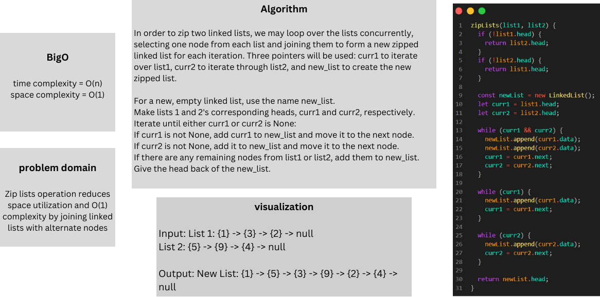

# linked-list-zip

### Whitebord:



### Approach & Efficiency:
Make an empty linked list to hold the results of zipped searches. Initialize the input linked lists' heads for pointers curr1 and curr2. Add the current nodes from curr1 and curr2, go on to the next node if it's already there, iterate while not None, and add the remaining nodes. bring back the new connected li's head

Time complexity: O(n)
Space complexity: O(1)

### Solution:

```javascript
 zipLists(list1, list2) {
      if (!list1.head) {
        return list2.head;
      }
      if (!list2.head) {
        return list1.head;
      }
  
      const newList = new LinkedList();
      let curr1 = list1.head;
      let curr2 = list2.head;
  
      while (curr1 && curr2) {
        newList.append(curr1.data);
        newList.append(curr2.data);
        curr1 = curr1.next;
        curr2 = curr2.next;
      }
  
      while (curr1) {
        newList.append(curr1.data);
        curr1 = curr1.next;
      }
  
      while (curr2) {
        newList.append(curr2.data);
        curr2 = curr2.next;
      }
  
      return newList.head;
    }
    
```
