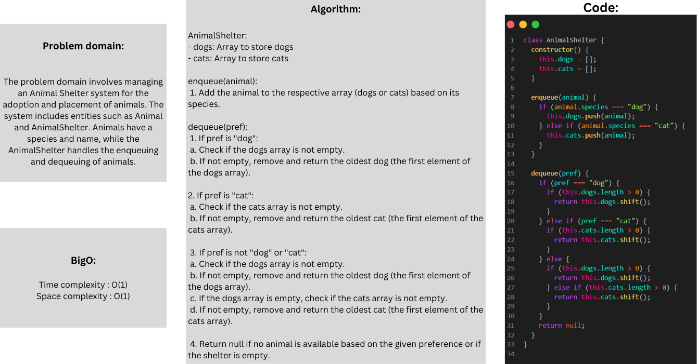
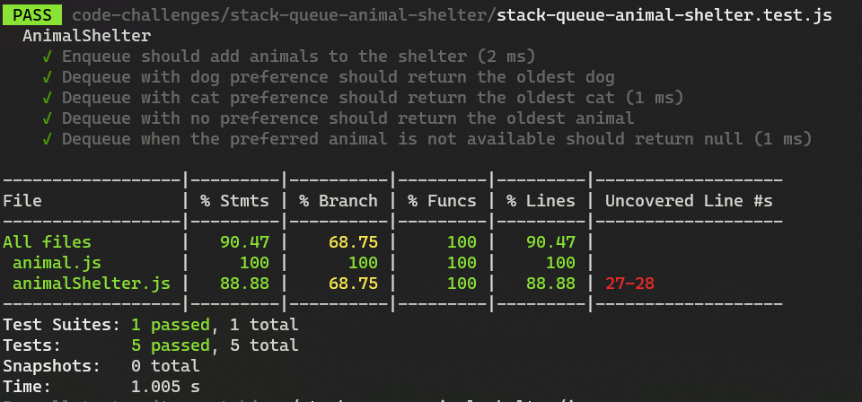

## stack-queue-animal-shelter

### Whiteboard:



### Approach & Efficiency:
 The approach and efficiency of the AnimalShelter class are optimized. Both enqueue and dequeue operations have constant time complexities, making them efficient regardless of the number of animals in the shelter. The space complexity is also minimal, as it only depends on the number of animals present in the shelter.

#### Big O:
Enqueue Operation:

- Time Complexity: O(1)
- Space Complexity: O(1)

Dequeue Operation:

- Time Complexity: O(1)
- Space Complexity: O(1)
### Solution:

```javascript
class AnimalShelter {
  constructor() {
    this.dogs = [];
    this.cats = [];
  }

  enqueue(animal) {
    if (animal.species === "dog") {
      this.dogs.push(animal);
    } else if (animal.species === "cat") {
      this.cats.push(animal);
    }
  }

  dequeue(pref) {
    if (pref === "dog") {
      if (this.dogs.length > 0) {
        return this.dogs.shift();
      }
    } else if (pref === "cat") {
      if (this.cats.length > 0) {
        return this.cats.shift();
      }
    } else {
      if (this.dogs.length > 0) {
        return this.dogs.shift();
      } else if (this.cats.length > 0) {
        return this.cats.shift();
      }
    }
    return null;
  }
}

```

### Test:


