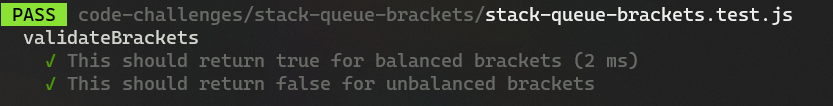

# stack-queue-brackets

### Whiteboard:


### Approach & Efficiency:

This code is designed to match and pair opening and closing brackets. It does this by keeping track of their index numbers and connecting them when a matching pair is found. If all brackets are successfully paired and removed from the main stack, it indicates that they have been joined together. However, if there are any remaining brackets in the stack, it means there are some brackets that are not paired and are considered "lonely."

#### Big O:

The time complexity is O(N)
The space complexity is O(N)

### Solution:

```javascript
function validateBrackets(string) {
  const stack = [];
  const openingBr = ["(", "[", "{"];
  const closingBr = [")", "]", "}"];
  const brackets = {
    "(": ")",
    "[": "]",
    "{": "}",
  };

  for (let i = 0; i < string.length; i++) {
    const char = string[i];
    if (openingBr.includes(char)) {
      stack.push(char);
    } else if (closingBr.includes(char)) {
      if (stack.length === 0) {
        return false;
      }
      const lastBracket = stack.pop();
      if (brackets[lastBracket] !== char) {
        return false;
      }
    }
  }

  return stack.length === 0;
}
```

### Test:

