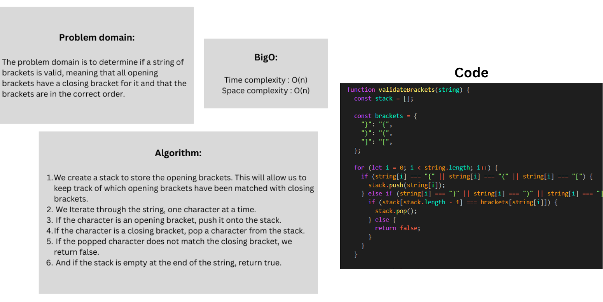

# stack-queue-brackets

### Whiteboard:



### Approach & Efficiency:

The validate_brackets function uses a stack to check whether the brackets in a given string are balanced or not. It iterates through each character in the string, pushing opening brackets onto the stack and checking closing brackets against the top of the stack. It efficiently determines the balance of brackets by performing a single pass through the string and utilizing a stack data structure.

#### Big O:

The time complexity is O(N)
The space complexity is O(N)

### Solution:

```javascript
function validateBrackets(string) {
  const stack = [];
  const openingBrackets = ["(", "[", "{"];
  const closingBrackets = [")", "]", "}"];
  const bracketPairs = {
    "(": ")",
    "[": "]",
    "{": "}",
  };

  for (let i = 0; i < string.length; i++) {
    const char = string[i];

    if (openingBrackets.includes(char)) {
      stack.push(char);
    } else if (closingBrackets.includes(char)) {
      if (stack.length === 0) {
        return false;
      }
      const lastOpeningBracket = stack.pop();
      if (bracketPairs[lastOpeningBracket] !== char) {
        return false;
      }
    }
  }

  return stack.length === 0;
}
```

### Test:


