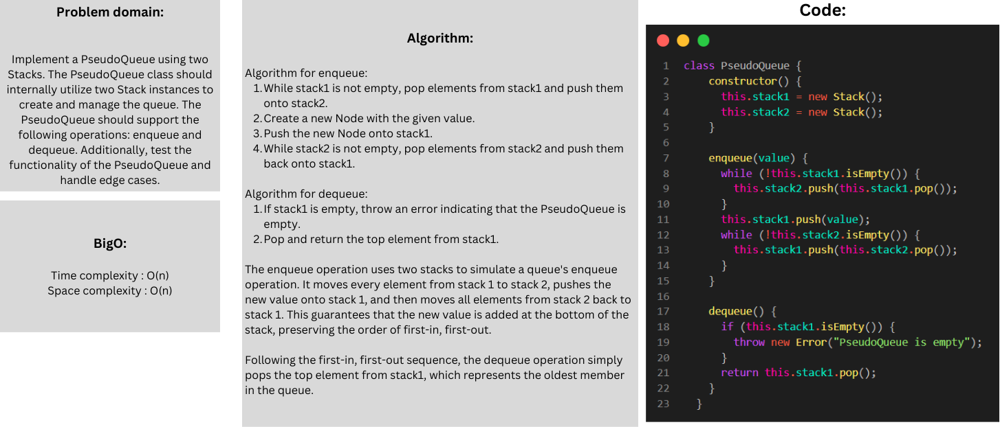

# Stack-queue-pseudo

### Whiteboard:


### Approach & Efficiency:

The technique used to create the PseudoQueue utilizing two Stacks is to replicate the behavior of a queue using the two stacks. The enqueue action moves elements between the two stacks in order to keep the first-in, first-out sequence, whereas the dequeue operation merely removes the top element from the first stack.

#### Big O:

The time complexity for the enqueue operation is O(N)
The time complexity for the dequeue operation is O(1) 

The space complexity of the PseudoQueue implementation is O(N)
### Solution:

```javascript
class PseudoQueue {
    constructor() {
      this.stack1 = new Stack();
      this.stack2 = new Stack();
    }
  
    enqueue(value) {
      while (!this.stack1.isEmpty()) {
        this.stack2.push(this.stack1.pop());
      }
      this.stack1.push(value);
      while (!this.stack2.isEmpty()) {
        this.stack1.push(this.stack2.pop());
      }
    }
  
    dequeue() {
      if (this.stack1.isEmpty()) {
        throw new Error("PseudoQueue is empty");
      }
      return this.stack1.pop();
    }
  }
```
### Test:

