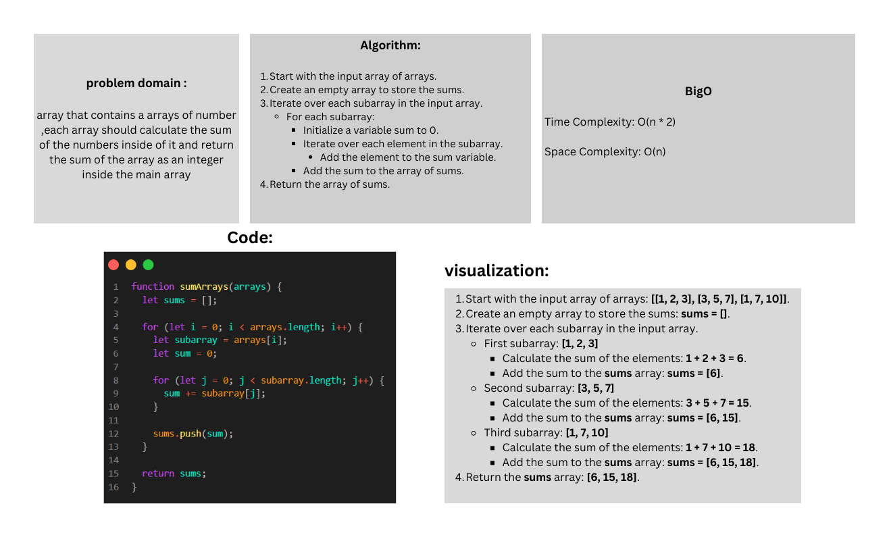

## Sum of arrays


### Approach & Efficiency
- We will iterate over each subarray and calculate the sum of its elements using a nested loop.
- The time complexity of this approach is O(n * 2).
- The space complexity is O(n) as we are storing the sums in a separate array.

### Solution

``` javascript 
function sumArrays(arrays) {
  const sums = [];

  for (let i = 0; i < arrays.length; i++) {
    let sum = 0;
    const subarray = arrays[i];

    for (let j = 0; j < subarray.length; j++) {
      sum += subarray[j];
    }

    sums.push(sum);
  }

  return sums;
}

// Example usage
const arrays = [[1, 2, 3], [3, 5, 7], [1, 7, 10]];
const result = sumArrays(arrays);
console.log(result); // Output: [6, 15, 18]
```

To run this code, you can copy it into a JavaScript environment, such as a browser console or a Node.js environment, and execute it.

The sumArrays function takes an array of arrays as input and returns an array containing the sums of the corresponding elements from the subarrays.

In the example usage, we provide the input [ [1, 2, 3], [3, 5, 7], [1, 7, 10] ] to the sumArrays function, and it outputs [6, 15, 18], which is the expected result.

