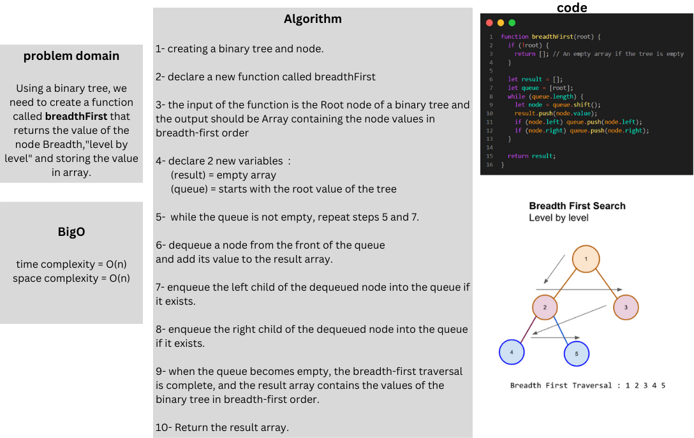
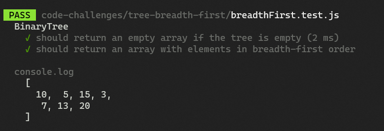

# Tree max

### Whiteboard:



### Approach & Efficiency:

The algorithm uses a queue to keep tracking the nodes that need to be visited, and it starts traversal from the root node and processe the nodes level by level, folowin a FIFO order,at each step the algorithm dequeues a node from the front of the queue and adds its value to the result array, and enqueues its left and right child nodes if they exist,finaly the traversal continues until the queue becomes empty, indicating that all nodes have been processed.

#### Big O:

Time complexity = O(n)
Space complexity = O(n)
- This algorithm have a O(n) space becouse of the storage of traversal results in the result array and the use of a queue during breadth-first traversal.

### Solution:

```javascript
function breadthFirst(root) {
  if (!root) {
    return []; // An empty array if the tree is empty
  }

  let result = [];
  let queue = [root];
  while (queue.length) {
    let node = queue.shift();
    result.push(node.value);
    if (node.left) queue.push(node.left);
    if (node.right) queue.push(node.right);
  }

  return result;
}
```

### Test:


