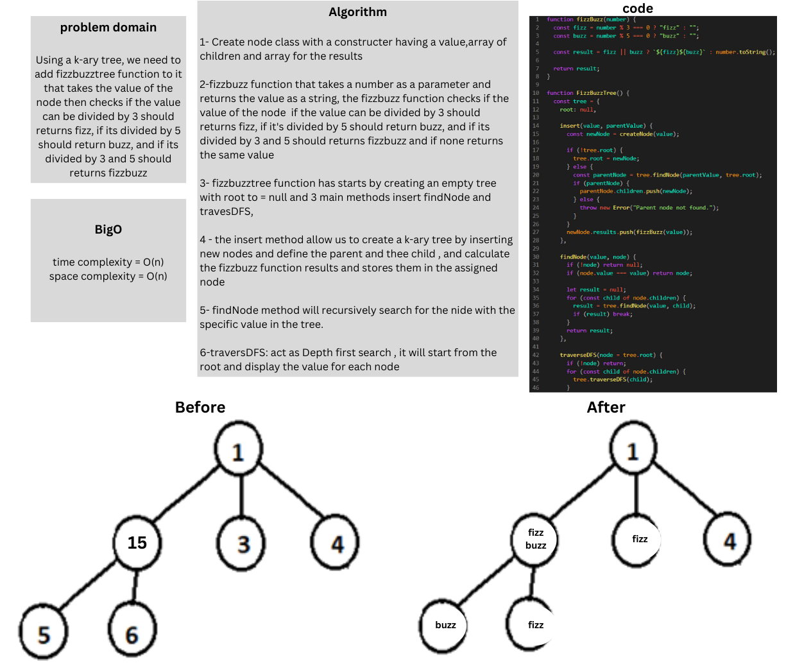
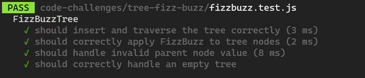

# tree-fizz-buzz

### Whiteboard:



### Approach & Efficiency:
The provided code defines a tree data structure called FizzBuzzTree. The tree consists of nodes, and each node contains a value, a list of children nodes, and a list to store the results of the "FizzBuzz" operation. The "FizzBuzz" operation is a function that, given a number, returns "fizz" if the number is divisible by 3, "buzz" if divisible by 5, "fizzbuzz" if divisible by both 3 and 5, and the number itself as a string if none of these conditions are met.

The FizzBuzzTree function allows you to insert new nodes with values, setting them as children of existing nodes. The tree can be traversed using Depth-First Search (DFS) to process and retrieve the results of the "FizzBuzz" operation for each node.


#### Big O:

Time complexity = O(n)
Space complexity = O(n)

### Solution:

```javascript
 function fizzBuzz(number) {
  const fizz = number % 3 === 0 ? "fizz" : "";
  const buzz = number % 5 === 0 ? "buzz" : "";

  const result = fizz || buzz ? `${fizz}${buzz}` : number.toString();

  return result;
}

class FizzBuzzTree {
  constructor() {
    this.root = null;
  }

  insert(value, parentValue) {
    const newNode = new Node(value);

    if (!this.root) {
      this.root = newNode;
    } else {
      const parentNode = this.findNode(parentValue, this.root);
      if (parentNode) {
        parentNode.children.push(newNode);
      } else {
        throw new Error("Parent node not found.");
      }
    }
    newNode.results.push(fizzBuzz(value));
  }

  findNode(value, node) {
    if (!node) return null;
    if (node.value === value) return node;

    let result = null;
    for (const child of node.children) {
      result = this.findNode(value, child);
      if (result) break;
    }
    return result;
  }

  traverseDFS(node = this.root) {
    if (!node) return;
    for (const child of node.children) {
      this.traverseDFS(child);
    }
  }
}


```

### Test:

