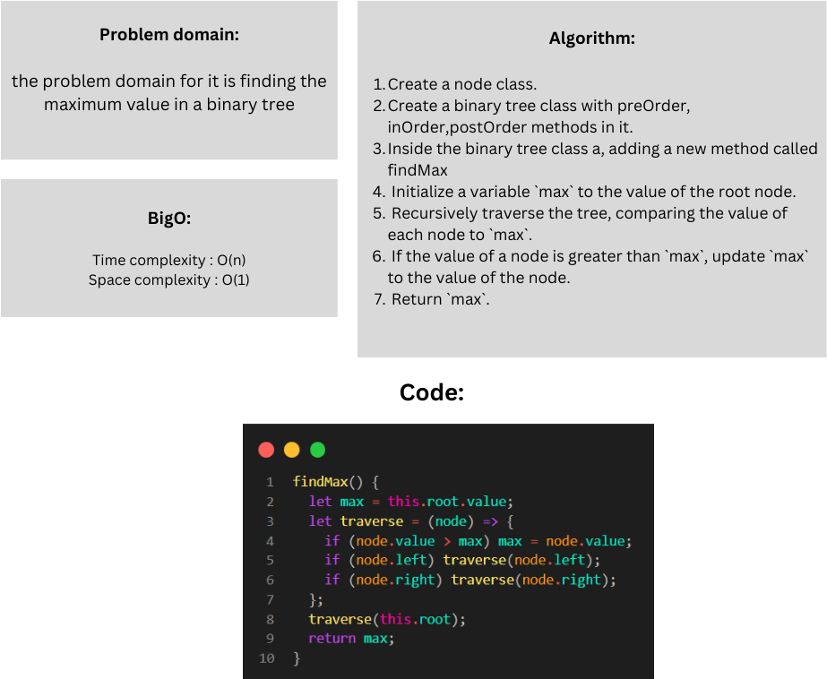

# Tree max

### Whiteboard:



### Approach & Efficiency:

The code begins with the root node and walks recursively through the left and right subtrees. When it reaches a node, it compares its value to the value of the variable max, if it is larger than max, max is changed to the value of the node.

#### Big O:

The time complexity is O(N)
The space complexity is O(1)

### Solution:

```javascript
  findMax() {
    let max = this.root.value;
    let traverse = (node) => {
      if (node.value > max) max = node.value;
      if (node.left) traverse(node.left);
      if (node.right) traverse(node.right);
    };
    traverse(this.root);
    return max;
  }
```

### Test:

```javascript

let tree = new BinaryTree();
tree.root = new Node(10);
tree.root.left = new Node(5);
tree.root.right = new Node(15);
tree.root.left.left = new Node(3);
tree.root.left.right = new Node(7);
tree.root.right.left = new Node(13);
tree.root.right.right = new Node(20);


console.log(tree.findMax());


```

By running this code you will get 20 as the max value un the tree.